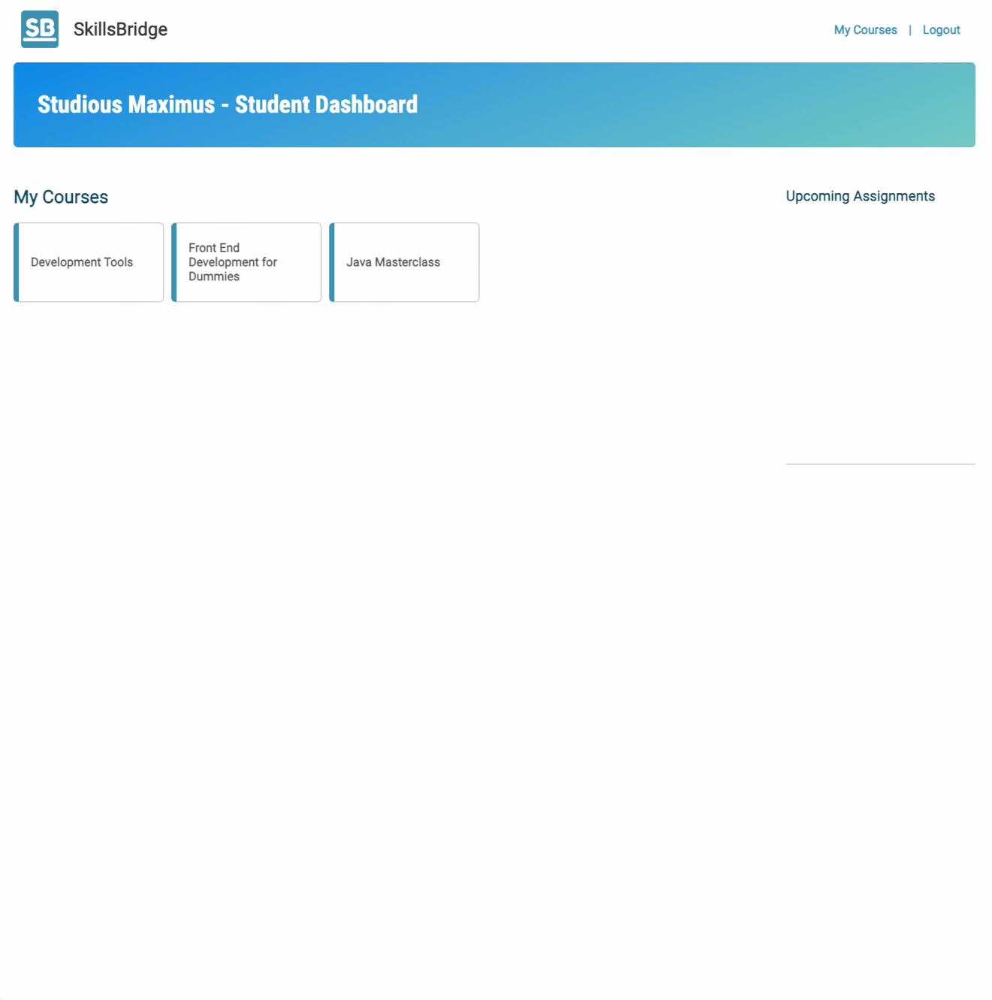

<!-- ABOUT THE PROJECT -->

## About The Project

[![SkillsBridge][product-screenshot]]()

Skillsbridge is an eLearning platform designed for teachers and students. It offers a comprehensive set of features that allows teachers to create and manage courses, modules, and lessons, while also allowing them to oversee student grades and handle student enrollment. On the other hand, students gain access to a user-friendly interface where they can view the courses they are invited to. Within these courses, they can effortlessly track their grades for homework submissions and explore the modules and lessons associated with each course. Additionally, students are provided with the functionality to submit their answers if a lesson requires an assignment to be completed.

### Built With

- ![HTML][HTML]
- ![CSS][CSS]
- ![JavaScript][JS]
- [![Vue][Vue.js]][Vue-url]
- [![Spring Boot][SpringBoot]][SpringBoot-url]
- [![PostgreSQL][pSql]][pSql-url]

### Demo

#### Teacher view

#### Student view

[linkedin-shield]: https://img.shields.io/badge/-LinkedIn-black.svg?style=for-the-badge&logo=linkedin&colorB=555
[linkedin-url]: https://linkedin.com/in/linkedin_username
[product-screenshot]: final_capstone-main/capstone/vue/src/assets/SkillsBridge.png
[HTML]: https://img.shields.io/badge/HTML5-E34F26?style=for-the-badge&logo=html5&logoColor=white
[JS]: https://img.shields.io/badge/JavaScript-F7DF1E?style=for-the-badge&logo=javascript&logoColor=black
[pSql]: https://img.shields.io/badge/PostgreSQL-316192?style=for-the-badge&logo=postgresql&logoColor=white
[pSql-url]: https://www.postgresql.org/
[CSS]: https://img.shields.io/badge/CSS3-1572B6?style=for-the-badge&logo=css3&logoColor=white
[Vue.js]: https://img.shields.io/badge/Vue.js-35495E?style=for-the-badge&logo=vuedotjs&logoColor=4FC08D
[Vue-url]: https://vuejs.org/
[SpringBoot]: https://img.shields.io/badge/SpringBoot-6DB33F?style=flat-square&logo=Spring&logoColor=white
[SpringBoot-url]: https://spring.io/projects/spring-boot#learn
